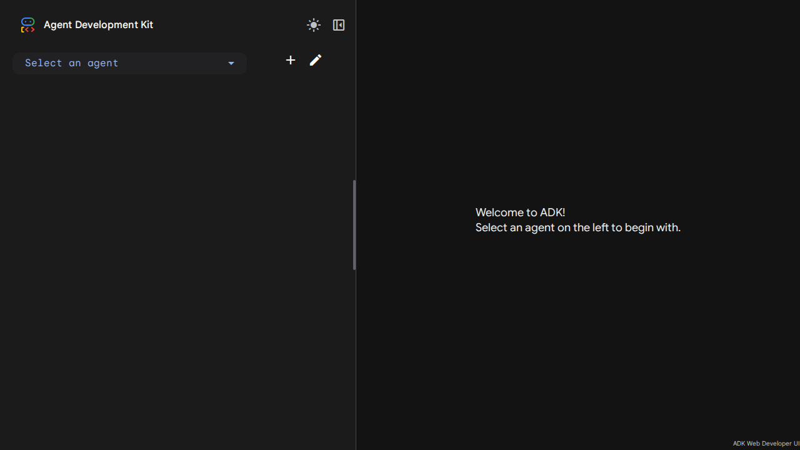
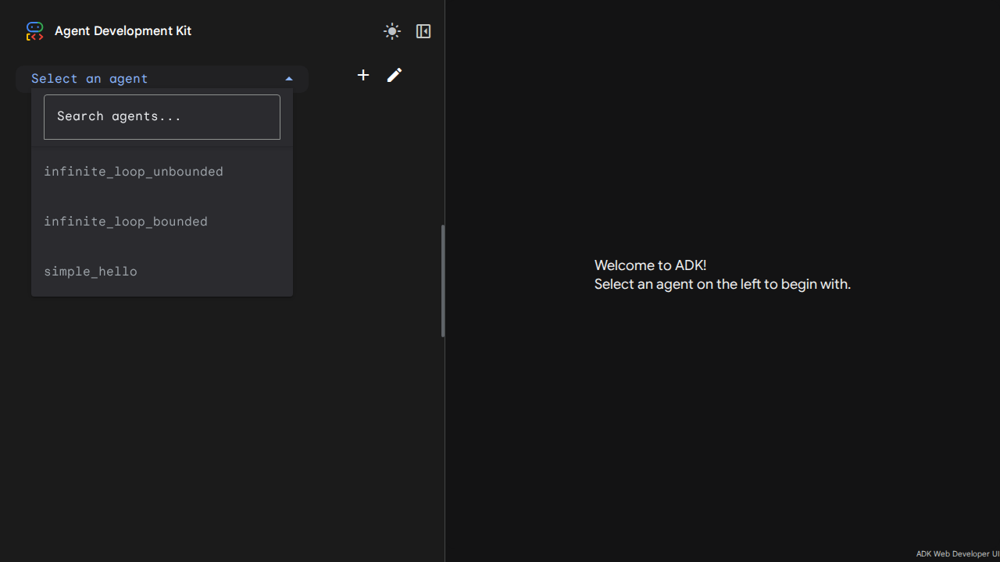
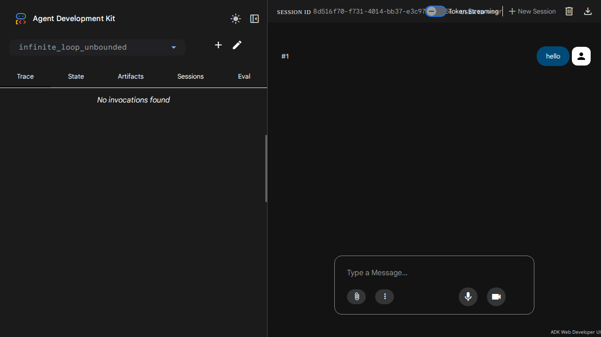
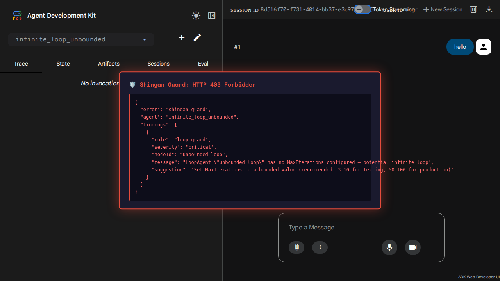
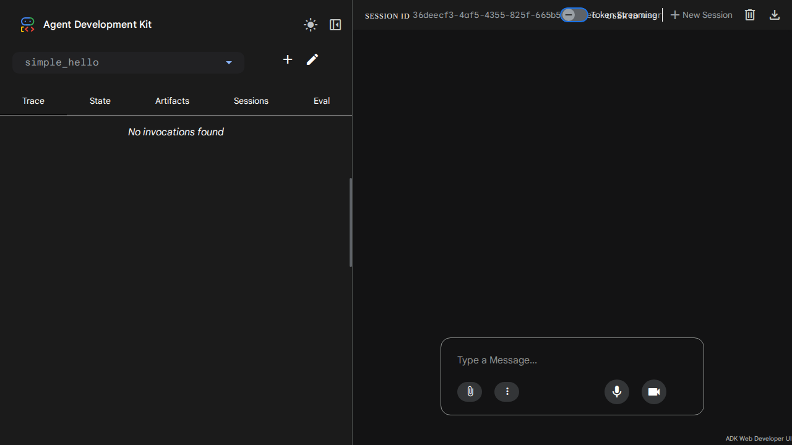
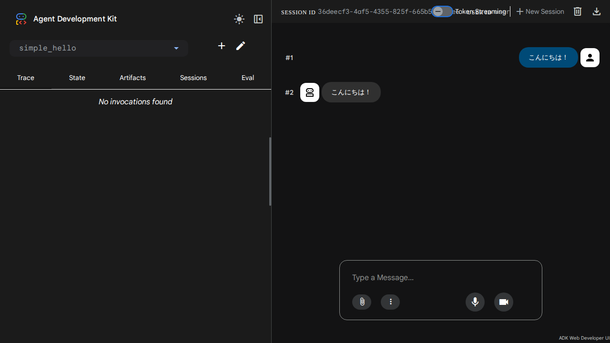
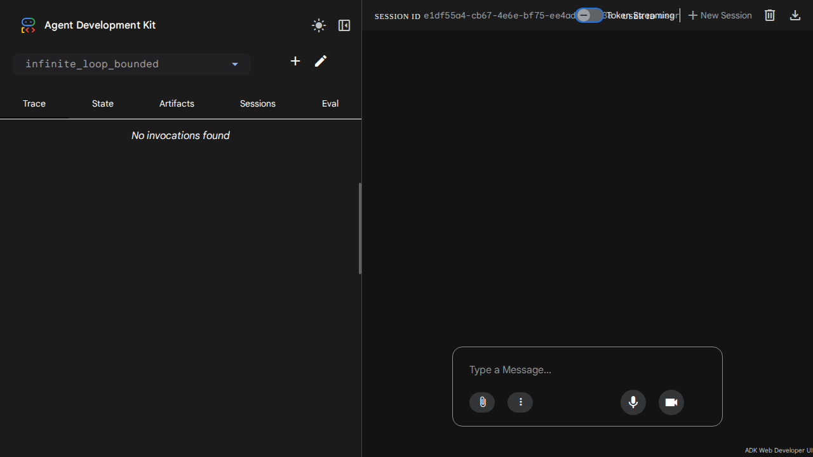
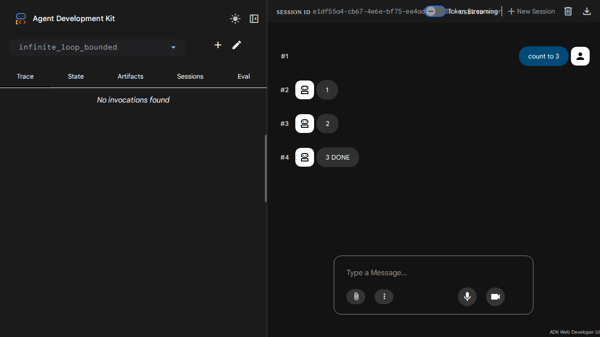

# デモ用スクリーンショット集 — Shingan ADK Web UI 統合

面接（2026-04-17 Kiva社）用のデモスクリーンショット。
Playwright で自動取得済み（`scripts/screenshots/capture.mjs`）。

---

## 面接ストーリー

> 「SamuraiAIのような "100%精度" を要求されるエージェントシステムでは、
> 設計時のバグが本番で致命的な結果をもたらします。
> ESLintがランタイムエラー前にリントエラーを出すように、
> ShinganはVertex AI Geminiへの実行前にワークフローを静的解析してガードします。」

---

## Step 1: ADK Web UI 起動確認（3エージェント登録済み）



**Agent Development Kit Web UI が起動した状態。**
左側の "Select an agent" ドロップダウンに3エージェントを登録してある。

---



**3エージェント一覧:**
- `infinite_loop_unbounded` — MaxIterations未設定の危険なLoopAgent
- `infinite_loop_bounded` — MaxIter=3の安全なLoopAgent
- `simple_hello` — シンプルなHello Worldエージェント

---

## Step 2: Shingan Guard が危険なAgentをブロック


**`infinite_loop_unbounded` を選択した状態。**
Session IDが自動生成され、チャット入力が使える状態になっている。

---



**"hello" を送信後 → "No invocations found"**

Shingan middlewareが `POST /api/run_sse` に割り込み、HTTP 403 Forbiddenを返した。
Vertex AI Geminiにはリクエストが一切届いていない（"No invocations found" = ADK実行記録なし）。

---



**Shingan Guard: HTTP 403 Forbidden — エラー詳細**

```json
{
  "error": "shingan_guard",
  "agent": "infinite_loop_unbounded",
  "findings": [
    {
      "rule": "loop_guard",
      "severity": "critical",
      "nodeId": "unbounded_loop",
      "message": "LoopAgent \"unbounded_loop\" has no MaxIterations configured — potential infinite loop",
      "suggestion": "Set MaxIterations to a bounded value (recommended: 3-10 for testing, 50-100 for production)"
    }
  ]
}
```

`loop_guard` ルールが `severity: critical` のFindingを検出し、実行を物理ブロック。
このエラーなしに実行したら、Gemini APIが数百回〜無制限に呼ばれ、
**数千円〜数万円のコスト事故**になる可能性がある。

---

## Step 3: 安全なAgentはそのままGeminiで実行



**`simple_hello` を選択。**
同じUIで、別のエージェントに切り替えるだけ。

---


**"こんにちは！" を送信 → Vertex AI Gemini が "こんにちは！" と応答**

Shinganの静的解析をパスしたエージェントだけが実際に実行される。
`#2` の応答バブルに "こんにちは！" が表示されている。

---



**Gemini応答の詳細表示（スクロール後）。**
ユーザーメッセージ（`#1`）と Gemini レスポンス（`#2`）が並んでいる。

---

## Step 4: MaxIter=3の有界LoopAgentも正常実行



**`infinite_loop_bounded` を選択。**
こちらはMaxIterations=3が設定されており、Shinganのloop_guardをパスする。

---



**"count to 3" を送信 → `1` `2` `3 DONE` と順番にカウントして正常終了**

LoopAgentが3回ループして "DONE" で終了している。
無限ループの危険はなく、Shinganがパスを承認した正しい動作。

---

## SamuraiAI との類推ストーリー

> 「入社後にどう統合しますか?」への回答

Shingan は Onion Architecture を採用しており、フレームワーク固有の知識は
`infrastructure/parser/` 層に閉じ込めている。

**SamuraiAI への統合は3ステップ:**

1. `infrastructure/parser/samurai.go` の `SamuraiWorkflow` 構造体を実スキーマに差し替え
2. `mapSamuraiNodeType` のケース文を実ノード名に更新
3. `testdata/samurai/` に実JSONを置いて `go test -race ./infrastructure/parser/...` を通す

**変更ファイル数: 最大2つ**（`samurai.go` + `factory/parser.go` の1行）。
`domain/` 層・`application/` 層は一切変更不要。

このアーキテクチャ判断は ADR-003 に記録済みであり、このデモで実証している。

---

## デモ再実行手順

```bash
# 1. shingan-web を起動
GOOGLE_CLOUD_PROJECT=axial-mercury-486503-j5 \
GOOGLE_CLOUD_LOCATION=us-central1 \
GOOGLE_GENAI_USE_VERTEXAI=true \
/home/hatyibei/Claude/shingan/shingan-web > /tmp/shingan-web.log 2>&1 &

# 2. 接続確認
curl -s http://localhost:8080/ | head -5

# 3. スクリーンショット再取得
cd /home/hatyibei/Claude/shingan/scripts/screenshots
node capture.mjs

# 4. 確認
ls -la *.png
```

---

*自動生成: `scripts/screenshots/capture.mjs` (Playwright v1.59.1 + Chromium)*
